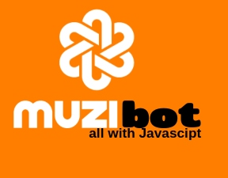

# MuziBot
---------------------------------------------------------------------------------------------------------

in collaboration with discord.com.

More than half of Umuzi recruits learned about it on social media, which proves the good marketing the organisation has online. But what makes potential recruits lose interest when inquiring about it?

One of the good practices in marketing is grabing your audience's attention and making sure that it is not lost before a certain action is done. 

With MuziBot potential recruits are able to learn about Umuzi without having to leave their LOVED socials. 

-----------------------------------------------------------------------------------------------------------

It focuses on these fields and helps: 

NOTE: The token used to log into the server is secret and may be terminated if detected on github so the `my_bot.js`will not connect to the discord server unless the owner (me) hands in the key.
